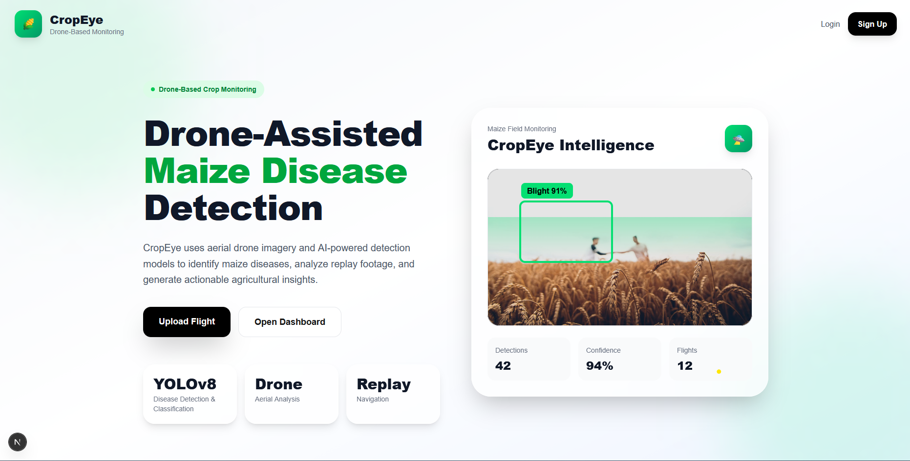
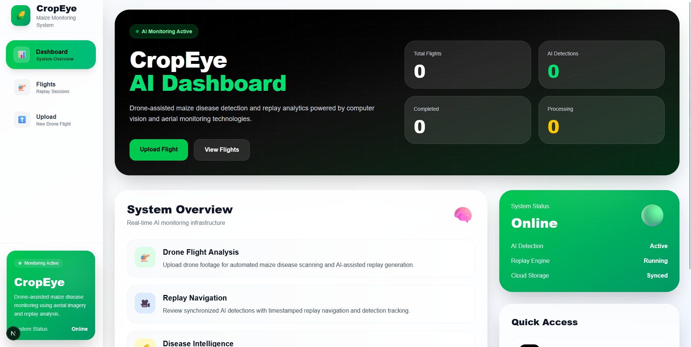
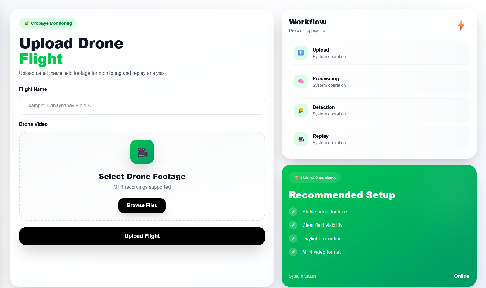

#  CropEye

CropEye is an AI-powered crop monitoring system that uses drone imagery and computer vision to detect crop diseases, helping farmers monitor field health and improve precision agriculture.

---

##  Features

- 🌱 AI-powered crop disease detection
- 🚁 Drone image processing
- 📊 Detection reports and analytics
- 📍 Flight history management
- 🖼️ Annotated image generation
- ☁️ Supabase cloud database and storage
- ⚡ YOLOv8-based object detection

---

## 🛠️ Tech Stack

### Frontend
- Next.js
- React
- TypeScript
- Tailwind CSS

### Backend
- Python
- FastAPI

### AI / Machine Learning
- YOLOv8
- OpenCV
- Ultralytics

### Database
- Supabase (PostgreSQL)

### Storage
- Supabase Storage

---

## 🗄️ Database Schema

### Flights

Stores information about every drone flight uploaded to the system.

| Column | Type |
|---------|------|
| id | UUID (Primary Key) |
| flight_name | Text |
| uploaded_video_url | Text |
| processed_video_url | Text |
| status | Text |
| total_detections | Integer |
| created_at | Timestamp |

---

### Detections

Stores every disease detected from processed drone imagery.

| Column | Type |
|---------|------|
| id | UUID (Primary Key) |
| flight_id | UUID |
| frame_name | Text |
| timestamp_sec | Double Precision |
| disease_name | Text |
| confidence | Double Precision |
| bbox_x | Double Precision |
| bbox_y | Double Precision |
| bbox_width | Double Precision |
| bbox_height | Double Precision |
| frame_image_url | Text |
| created_at | Timestamp |

### Relationship

```text
Flights (1)
      │
      │ id
      ▼
Detections (Many)
flight_id → flights.id
```

---

## 📁 Project Structure

```text
CropEye/
├── frontend/
├── backend/
├── models/
├── scripts/
├── app/
├── public/
├── utils/
└── README.md
```

---

## 🚀 Installation

### Clone the repository

```bash
git clone https://github.com/your-username/CropEye.git
cd CropEye
```

### Install frontend dependencies

```bash
npm install
```

### Start the frontend

```bash
npm run dev
```

### Install backend dependencies

```bash
pip install -r requirements.txt
```

### Start the backend

```bash
python app.py
```

---

## 🧠 AI Model

CropEye uses a custom-trained **YOLOv8** model to detect crop diseases from aerial images captured by drones. Detected diseases are localized with bounding boxes and stored in the database together with confidence scores for further analysis.

---

## 📸 Screenshots

### 🏠 Landing Page



---

### 📊 Dashboard



---

### ✈️ Flight Management


---

### ⬆️ Upload Page



---

## 🚀 Future Improvements

- Real-time drone streaming
- Multi-crop disease detection
- Mobile application
- Weather data integration
- Predictive disease analytics
- GPS-based disease mapping

---

## 📄 License

This project is licensed under the MIT License.

---

## 👨‍💻 Developers

Developed as a capstone project for applying Artificial Intelligence, Computer Vision, and Precision Agriculture to support early crop disease detection using drone imagery.
